```text
          _           _    __
    _ __ | | __ _ ___| |_ / _|_      __
   | '_ \| |/ _` / __| __| |_\ \ /\ / /
   | |_) | | (_| \__ \ |_|  _|\ V  V /
   | .__/|_|\__,_|___/\__|_|   \_/\_/
   |_|

plastfw@github:~$ cat ~/about.txt

role       developer
languages  C# / Python / Go / Bash
focus      games / tools / utilities / TUI apps / bots
approach   practical software, small tools, terminal-first workflows

plastfw@github:~$ tree ~/workspace

workspace
├── games
├── tools
├── utilities
├── tui-apps
└── bots
```


